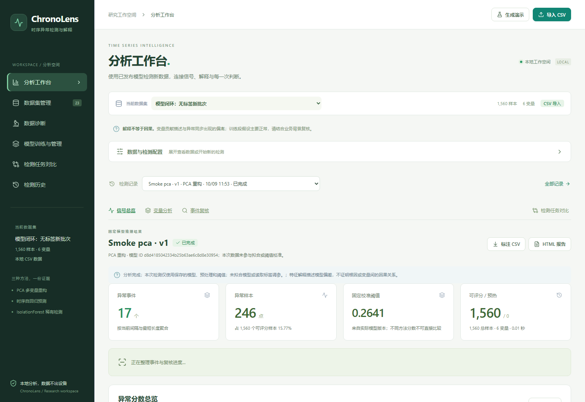
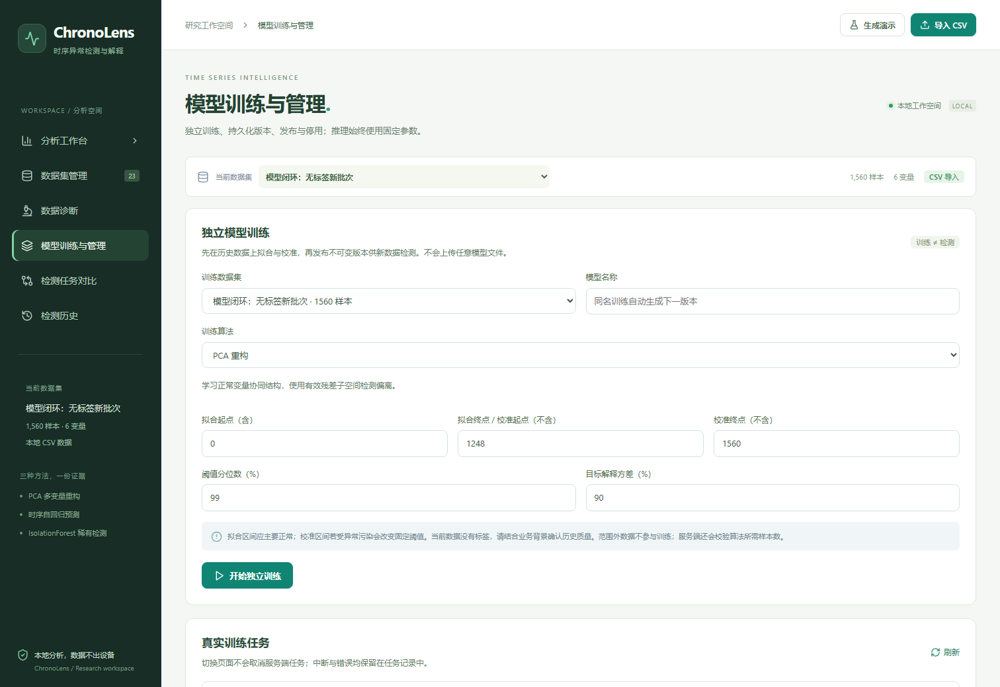
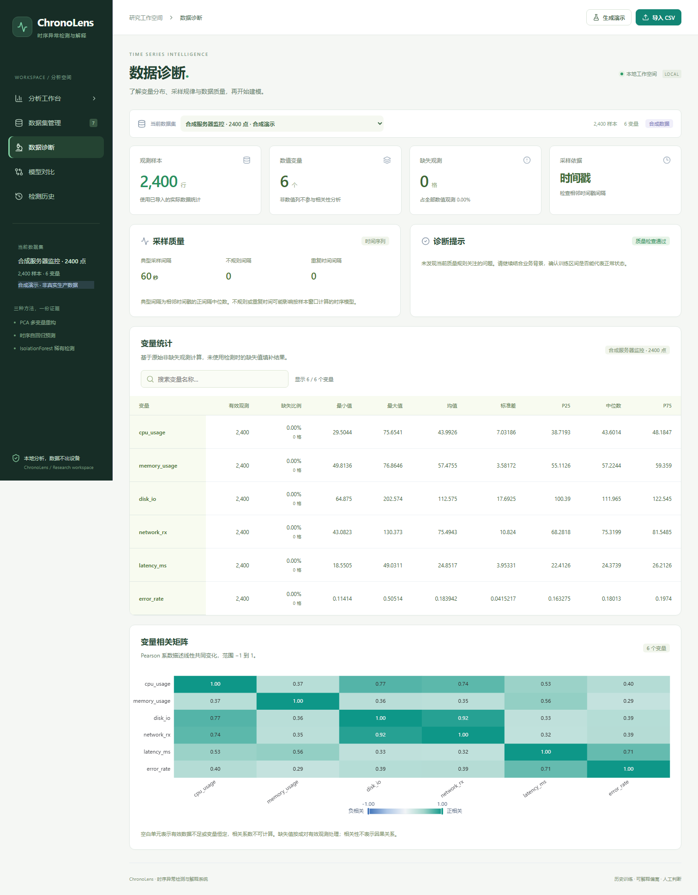

# ChronoLens · 时序异常检测与解释系统

基于 **FastAPI、React、TypeScript、ECharts 与 scikit-learn** 的本地多变量时序分析工作台。

**当前定位：** 本地 CSV 多变量时序分析、独立训练与阈值校准、不可变模型版本管理、已发布模型复用检测、变量偏离解释、人工复核与报告导出。

**已完成模型复用闭环：** 历史数据训练 → 保存模型 → 发布 → 上传新数据 → 选择模型检测。后端重启后仍能加载；推理不重新拟合预处理、检测器或阈值。

> 当前已实现下文第一阶段的模型生命周期。后续效果优化、漂移监测、实时接入和公网部署仍按实际需要扩展，不将计划描述为现有功能。

本次后端与启动器协议版本为 `2.0.0`。若旧服务仍在运行，先在旧窗口按 `Ctrl+C` 停止，再运行 `start.bat`；启动器不复用旧版训练检测一体化 API。





## 1. 当前功能与真实性

| 功能 | 当前状态 | 能力边界 |
|---|---|---|
| CSV 导入 | 已实现真实解析、校验和持久化 | 当前为文件批量导入，不是持续采集 |
| PCA 重构检测 | 已实现模型拟合和重构残差评分 | 学习当前样本的变量关系，不是未来预测 |
| 时序 Ridge 检测 | 已实现逐变量滞后预测和残差评分 | 每个变量独立进行线性预测，不建模跨变量时序关系 |
| IsolationForest 检测 | 已实现森林拟合和隔离分数计算 | 变量贡献采用偏差代理，不是森林内部归因 |
| 分数曲线、参考曲线与热力图 | 已接入后端真实分析数组 | 展示的是检测结果和贡献聚合 |
| 数据诊断 | 已实现分布、缺失、相关性和采样间隔统计 | 不等于漂移检测或自动数据修复 |
| 事件分段与严重度 | 已根据分数、阈值和配置生成 | 严重度是规则分级，不等于实际业务损失 |
| 事件解释 | 已实现变量偏离排名和占比 | 不证明因果关系或故障根因 |
| 人工复核与备注 | 已实现 SQLite 持久化 | 不会自动更新模型、阈值或真实标签 |
| CSV 与离线 HTML 导出 | 已根据实际任务生成 | 不是固定示例报告 |
| 检测任务对比 | 比较同一数据集最多三次已完成任务及模型版本 | 不直接比较不同算法的原始分数 |
| 内置演示数据 | 已实现可复现的合成数据生成 | 非真实服务器采集数据，非真实业务效果证明 |
| 模型保存、加载和独立推理 | 已实现真实资产持久化、发布与模型选择 | 仅加载系统或共享训练脚本生成的可信模型 |
| 实时接入、持续监控与告警 | 尚未实现 | 按后续部署需求扩展 |

### 哪些内容容易被误认为“假的”？

- **演示数据是合成的，检测结果不是伪造的。** 六个服务器指标由周期信号和噪声生成，再人工注入五段异常。检测分数、事件和指标仍由真实算法计算。
- **任务对比与模型管理已分开。** 前者比较检测结果，后者负责模型训练、来源、版本、发布和停用。
- **变量贡献不是故障根因。** “延迟贡献最高”表示延迟偏离明显，不能直接证明延迟是故障原因。

CSV 导入、训练、模型复用、检测、诊断、复核和报告均使用真实数据与算法计算，不返回固定演示结果。

## 2. 当前模型如何工作

```text
历史 CSV → 独立拟合段 → 学习预处理与检测器 → 独立校准段确定阈值
        → 保存不可变模型版本 → 用户发布

新 CSV → 校验特征并按名称对齐 → 固定预处理 → 已发布模型评分
       → 保存分数、可评分状态、事件和版本来源 → 解释、复核、导出
```

训练配置指定 `fit_start`、`fit_end`、`calibration_end`，区间均为零基、左闭右开。未指定终点时使用前 80% 拟合、后 20% 校准；区间外数据不参与训练或阈值选择。标签只用于污染提示和检测后的评估，不自动筛选训练或调参。

| 算法标识 | 实现 | 异常分数 | 解释方式 |
|---|---|---|---|
| `pca` | `sklearn.decomposition.PCA` | 标准化重构残差平方的变量均值 | 各变量重构残差平方 |
| `temporal` | 每个变量一个 `sklearn.linear_model.Ridge` | 标准化预测残差平方的变量均值 | 各变量预测残差平方 |
| `isolation` | `sklearn.ensemble.IsolationForest` | 负的 `score_samples` 输出 | 相对历史稳健中心的绝对标准化偏差代理 |

模型资产保存检测器、特征名与顺序、填充值、标准化中心和尺度、校准阈值、配置、训练区间与依赖版本。PCA 保存实际有效的重构子空间，最多保留变量数减一；Ridge 保存每个变量的预测器；孤立森林同时保存解释所用的稳健中心与尺度。

检测请求只指定数据集、模型版本、事件分段参数和可选数据流 ID，不接受训练比例或新阈值分位数。PCA/孤立森林对新数据全段评分，不再排除文件前段。

### 时序历史与预热

- 独立文件的最初 `window` 行没有完整历史，显示预热/不可评分。分数和判定不伪装成正常，统计、指标与热力图排除这些点。
- 连续批次可指定同一 `stream_id`；状态按模型版本与数据流隔离并持久化。不同机器不能混用。
- 真实时间戳重叠或倒序拒绝，时间断层重置历史并提示预热；没有时间戳的流按显式提交顺序追加。
- 任务成功与流状态更新在同一事务提交，失败任务不推进窗口。事件分段仍以当前批次为范围。

### 模型存储与安全

SQLite 保存模型与任务记录；`model-*.joblib` 保存可信模型资产，`dataset-*.npz` 和 `run-*.npz` 保存数据与分析数组。加载前核对内部 SHA256 和格式、scikit-learn 版本。不兼容或损坏明确报错，不自动重新训练。不开放任意 pickle/joblib 模型上传。

旧版现场拟合历史仍可读取、复核和导出，明确标记没有独立模型；不能从历史结果数组伪造可恢复的模型版本。

| 文件 | 职责 |
|---|---|
| `backend/engine.py` | `train_model`、固定参数 `detect`、事件和评估 |
| `backend/model_assets.py` | 原子模型保存、加载前完整性及拟合状态校验 |
| `backend/storage.py` | SQLite/NPZ/模型记录与跨批次状态持久化 |
| `backend/app.py` | 训练、发布、模型选择检测、复核与导出 API |
| `frontend/src/components/ModelManagement.tsx` | 真实训练任务与模型版本管理 |
| `scripts/train_model.py` | 与平台共用核心的本地脚本训练 |
| `scripts/prepare_smd.py` | 官方 SMD 单机器下载、CSV 转换与来源记录 |

## 3. 已实现的模型生命周期

当前支持以下流程；重训练由用户显式发起，不自动用复核结论更新模型：

```text
历史数据 → 训练与阈值校准 → 保存不可变模型版本 → 发布
                                                  ↓
新数据 → 特征校验 → 固定预处理 → 指定模型推理 → 分数与事件
                                                  ↓
                                         保存结果 → 人工复核
                                                  ↓
                              后续评估 → 主动重训练 → 新版本发布
```

### 核心约定

1. **训练与推理解耦。** 检测任务指定模型版本，推理过程中不调用 `fit`。
2. **完整保存模型资产。** 保存检测器、特征契约、填充值、标准化参数、阈值、配置及训练来源。
3. **固定训练时参数。** 新数据不得重新学习标准化参数或自动覆盖模型阈值。
4. **明确输入契约。** 按特征名排列输入，拒绝缺失必需列、非数值输入和不兼容数据。
5. **模型版本可追溯。** 检测记录关联不可变版本；发布新版本不覆盖旧结果。
6. **时序状态显式管理。** 管理历史窗口，隔离不同数据流；历史不足显示预热或不可评分，不伪装成正常。
7. **复核不直接修改线上模型。** 复核形成独立标注，后续训练和评估按明确流程使用。
8. **模型文件安全加载。** 只加载受信任的模型产物；若采用 pickle/joblib 等格式，不允许直接反序列化不可信上传文件。

“持续使用”可以先实现为不断导入新 CSV 并复用模型；不必第一阶段同时实现实时数据流和告警。

## 4. 统一改进清单

优先级：**P0：目标必需；P1：实际使用前重点补齐；P2：按部署需求扩展。**

| 编号 | 模块 | 当前状态 / 剩余不足 | 能力与验收要求 | 优先级 |
|---:|---|---|---|:---:|
| 1 | 训练与检测流程 | 已分离并验证 | 指定已发布模型检测时不调用 `fit` | P0，已完成 |
| 2 | 模型持久化 | 三种算法已保存与重启加载 | 保存真实拟合检测器，不只保存分数 | P0，已完成 |
| 3 | 预处理持久化 | 已保存并固定复用 | 新数据不重新学习填充值、中心或尺度 | P0，已完成 |
| 4 | 特征契约 | 已按名称对齐与检查 | 列重排保持结果一致，缺列/不兼容明确拒绝 | P0，已完成 |
| 5 | 阈值复用 | 已保存校准阈值 | 推理不重新校准；更新通过新版本发布 | P0，已完成 |
| 6 | 独立推理接口 | 已接收模型与新数据集 ID | 无标签新数据也能检测，监督指标留空 | P0，已完成 |
| 7 | 新数据全段检测 | PCA/森林已全段，Ridge 明确预热 | 不将新数据前段当作训练区间 | P0，已完成 |
| 8 | 时序历史状态 | 已持久化、隔离、序列化提交 | 跨批次预测一致，断层预热，失败不推进历史 | P0，已完成 |
| 9 | 模型管理界面 | 训练、版本详情、发布、停用已接入 | 展示特征、阈值、来源和真实任务进度 | P0，已完成 |
| 10 | 结果可追溯性 | 已记录不可变模型版本 | 新模型不覆盖旧结果，旧版历史不伪造模型 | P0，已完成 |
| 11 | 真实数据验证 | 已在官方 SMD 单机器完成三算法固定配置试验 | 更多机器与真实场景仍需独立验证，不把基线成绩当生产效果 | P1 |
| 12 | 训练数据质量 | 已支持区间选择与污染提示，未按标签自动筛选 | 选择正常区间；进一步筛选须保持时序窗口正确 | P1 |
| 13 | 数据划分 | 已独立拟合、校准与新数据测试 | 保留独立验证/测试划分，不用测试标签调参 | P1 |
| 14 | 模型对比 | 已改名检测任务对比并显示版本 | 更完整的多数据集模型评估按需增加 | P1 |
| 15 | 异常解释 | 孤立森林贡献是代理，解释能力有限 | 分别标注残差贡献和偏差代理；真正森林归因另行实现与验证 | P1 |
| 16 | 根因结论 | 未实现因果诊断 | 输出疑似相关变量和证据；不把偏离排名当根因，需要时接入业务诊断信息 | P1 |
| 17 | 评估指标 | 点级与事件级表现可差异很大，无标签不能证明准确性 | 同时报告点级与事件级表现、误报和延迟；无标签明确无法计算准确性指标 | P1 |
| 18 | 算法范围 | Ridge 为逐变量线性预测，其他方法缺乏显式时序建模 | 先验证真实数据短板，再决定是否增加跨变量、季节性或深度模型 | P1 |
| 19 | 复核反馈 | 已保存复核，但未形成学习闭环 | 保留原始结果，复核形成独立标注，支持后续评估和训练使用 | P1 |
| 20 | 模型漂移 | 没有模型失效提示 | 监测缺失、分布与异常率变化；提示过期，重训练产生新版本并评估后发布 | P1 |
| 21 | 任务可靠性 | 进程内线程池和队列的恢复能力有限 | 明确任务状态与重启中断处理；长任务建立可靠记录及恢复策略 | P1 |
| 22 | 持续数据接入 | 主要是手动 CSV 导入 | 批量阶段增加定时文件/API 接入；实时阶段再增加流式输入、状态与去重 | P2，实时目标时必需 |
| 23 | 自动告警 | 没有通知链路 | 基于事件告警，增加去重、冷却和恢复通知，避免逐点刷屏 | P2，监控目标时必需 |
| 24 | 部署安全 | 当前面向本机单人，没有多用户权限 | 对外或多人部署增加认证、数据/模型权限和操作审计 | P2，对外部署时必需 |

## 5. 实施阶段与验收

### 第一阶段：模型复用闭环（已实现并验证）

范围：改进清单 1–10 项。先复用现有三种算法，不以增加深度学习为前提。

验收标准：

- 使用历史数据完成一次训练、校准和模型发布。
- 停止并重启后端，已发布模型仍可加载。
- 上传另一份不带标签的新数据，选择该模型完成检测，不重新训练。
- 新数据沿用训练时特征顺序、填充值、标准化参数和阈值。
- 缺列、列顺序变化等输入情况得到明确处理，不静默产生错误结果。
- PCA 与孤立森林对新数据全段评分；时序算法明确处理历史窗口与预热。
- 每次检测结果可追溯至模型版本和输入数据。
- 现有图表、解释、复核和导出能够消费独立推理的结果。

### 第二阶段：效果与可靠性（部分完成，未整体验收）

范围：改进清单 11–21 项。

验收标准：

- 固定训练、校准、测试划分，在真实或公开数据上评估，不使用测试标签调参。
- 展示点级与事件级指标、误报和检测延迟，不只展示某个高分指标。
- 明确解释方法及非因果边界，不把偏差代理描述为模型内部归因。
- 复核标注与原始检测结果分离，能够用于后续评估。
- 模型更新生成新版本，旧版本及旧结果仍可追溯。
- 服务重启或任务失败后不会出现永久运行中的虚假任务状态。

### 第三阶段：按需持续监控（尚未实现）

范围：改进清单 22–24 项。

验收标准：

- 新数据能够按明确策略自动接入，批次与数据流可识别。
- 时序窗口状态在批次边界保持正确，不同数据流互不污染。
- 告警有去重、冷却、恢复和失败记录。
- 多人或对外部署时，访问控制覆盖数据、模型、检测结果和操作记录。

## 6. 推荐数据集与本地训练

推荐 [SMD / Server Machine Dataset 官方目录](https://github.com/NetManAIOps/OmniAnomaly/tree/master/ServerMachineDataset)。官方说明包含 28 台服务器，每台 38 维；不同机器应分别训练和测试，不拼接成同一条设备序列。

本项目已下载并转换 `machine-1-1`：训练与测试各 **28,479 行、38 个特征**，测试标签含 2,694 个异常点。每个 CSV 均满足平台行数、维度和 25 MiB 大小限制。数据采用 [MIT 许可](https://github.com/NetManAIOps/OmniAnomaly/blob/master/ServerMachineDataset/LICENSE)，原始与转换目录保留许可。

```powershell
.\.venv\Scripts\python.exe scripts\prepare_smd.py --machine machine-1-1 --download
```

输出 `datasets/SMD/prepared/machine-1-1_train.csv`、`machine-1-1_test.csv` 及来源、SHA256 与建议区间 manifest。下载使用 GitHub 官方 API；原始数字不重新标准化，匿名列命名为 `metric_01`–`metric_38`，测试标签命名为 `is_anomaly`。原数据无时间戳，使用样本序号，不补造真实时间。

平台训练设置：上传训练 CSV，拟合起点 **0**、拟合终点 **22783**、校准终点 **28479**、阈值分位数 **99%**。发布后上传测试 CSV，选择同一模型检测；测试标签仅用于评估。

网络不能访问 GitHub 时，手动取得官方 `train/`、`test/`、`test_label/` 和许可文件后转换：

```powershell
.\.venv\Scripts\python.exe scripts\prepare_smd.py --source-dir "下载后的ServerMachineDataset目录"
```

独立脚本使用与平台相同的训练核心和默认数据目录，完成后刷新模型管理即可看到：

```powershell
.\.venv\Scripts\python.exe scripts\train_model.py datasets\SMD\prepared\machine-1-1_train.csv --name SMD-machine-1-1-PCA --algorithm pca --fit-end 22783 --calibration-end 28479 --publish
```

不需要 GPU 或异常训练标签，也不需要执行原仓库的 GRU/VAE。先形成现有算法基线，再用独立验证数据决定是否需要更复杂模型；无标签不能宣传未经验证的准确率。

## 7. 快速运行（Windows）

安装 **Python 3.10、3.11 或 3.12**，安装时启用 PATH。在项目根目录运行：

```powershell
.\start.bat
```

若需要克隆仓库，先安装 Git，然后执行：

```powershell
git clone https://github.com/yxq040517/Time-Series.git
cd Time-Series
.\start.bat
```

首次运行会创建 `.venv` 并安装 Python 依赖，需要网络。启动器使用 `frontend/dist` 的已构建界面，普通运行无需 Node.js；若该目录缺失，需要先进行前端构建。

浏览器默认打开 **http://127.0.0.1:8767**。保持启动窗口开启，按 `Ctrl+C` 停止该次启动的服务。

其他启动方式：

```powershell
.\start.bat --no-browser
.\start.bat --port 8768
```

数据保存在 `backend/data/`，该目录不进入 Git。迁移时应单独备份数据；虚拟环境应在新电脑重新创建。

### 当前体验流程

1. 导入训练历史或生成合成演示。
2. 进入模型训练与管理，选择名称、算法、拟合/校准区间和算法参数。
3. 等待真实训练完成，检查模型来源、特征和阈值，再发布。
4. 在工作台导入新数据，选择兼容的已发布模型检测，不重新训练。
5. 查看分数、原始/参考曲线、变量偏离、诊断和检测任务对比。
6. 保存人工结论和备注，导出 CSV 或 HTML 报告。

合成演示可使用拟合 `[0,672)`、校准 `[672,840)`。对同一份合成数据检测仅用于体验流程，实际效果必须在独立测试数据验证。

### 当前 CSV 约束

- 1–100,000 行；训练另外校验其拟合/校准最低样本量。
- 2–64 个数值变量。
- 文件最大 25 MiB。
- 时间列须升序；无时间列时使用样本序号。
- 标签列可选，取值为 0 或 1。
- UTF-8 / GB18030 表头预览与时间、标签列映射已有实现。



## 8. 开发与测试

前端开发和重建使用 **Node.js 24**：

```powershell
cd frontend
npm ci
npm run dev
# 开发界面 http://127.0.0.1:5173，API 代理到 8767
npm run build
```

后端与单元测试，在项目根目录运行：

```powershell
.\.venv\Scripts\python.exe -m pip install -r requirements-dev.txt
.\.venv\Scripts\python.exe -m pytest -p no:cacheprovider -q
node scripts/test_configuration_import.mjs
```

浏览器验收需先启动服务、安装前端依赖及 Playwright 浏览器：

```powershell
cd frontend
npx playwright install chromium
cd ..
node scripts/verify_ui.mjs
node scripts/verify_upgrade.mjs
node scripts/verify_diagnostics.mjs
node scripts/test_review_races.mjs
```

验收脚本会在所连接服务中创建合成测试数据和检测任务。可通过 `CHRONOLENS_URL` 指向独立验收服务，通过 `CHRONOLENS_DATA_DIR` 指定独立后端数据目录，避免混入日常数据。

### 本次运行证据

- Python 3.10：**35 项行为回归通过**；Node：**4 项 CSV 行为检查通过**；严格 TypeScript 与 Vite 生产构建通过。
- 真实隔离 HTTP 服务：三算法训练/保存/发布、无标签新数据检测、进程重启前后分数和阈值一致、特征重排、整列缺失填充、缺列拒绝及旧版历史读取/导出。
- 推理对 `PCA.fit`、`Ridge.fit`、`IsolationForest.fit` 设置失败守卫，未触发重新拟合；损坏模型文件在反序列化前拒绝。
- 时序：整批/分批预测一致、单点批次续接、独立流隔离、全部预热、重叠拒绝、断层预热及失败不更新状态。
- 真实浏览器：页面训练与发布、新数据模型选择、实际图表缩放、事件解释、复核保存、CSV/HTML 下载及刷新历史。桌面 1512px、手机390px无横向溢出或运行时错误；移动导航选中项保持可见。

官方 SMD `machine-1-1` 固定配置试验：拟合 `[0,22783)`，校准 `[22783,28479)`，独立测试28,479点；阈值分位数99%、PCA方差0.9、Ridge窗口8，未用测试标签调参，未做 point adjustment。

| 算法 | 可评分点 | 精确率 | 召回率 | 点级 F1 |
|---|---:|---:|---:|---:|
| PCA | 28479 | 0.168 | 0.999 | 0.287 |
| 时序 Ridge | 28471 | 0.657 | 0.312 | 0.423 |
| IsolationForest | 28479 | 0.290 | 0.405 | 0.338 |

**这些是未调优的单机器基线，不是论文最优成绩或生产准确率。** PCA 的误报明显，Ridge 有漏检；模型生命周期已完成不代表效果问题已解决。证据位于 `artifacts/model-lifecycle/` 的 setup、restart、browser、legacy、smd JSON 与实际截图。

## 9. 项目结构

```text
backend/             FastAPI、训练/检测、模型资产、SQLite/NPZ/流状态与测试
frontend/src/        React/TypeScript 界面与 ECharts 分析组件
frontend/dist/       生产界面构建产物（启动前需存在）
examples/            合成 CSV 与数据字典
datasets/SMD/        官方单机器原始数据、许可与可直接导入的CSV（不入Git）
scripts/             启动器、共享核心训练、SMD下载转换及浏览器验收
artifacts/           已有验收产物与截图
docs/                方案、实施记录与界面截图
start.bat            Windows 启动入口
requirements.txt     Python 运行依赖
requirements-dev.txt Python 开发依赖
开始使用.txt         简明运行说明
使用说明.html        离线使用说明
README.md            已实现能力、实际验证、公开数据及后续边界
```

## 10. 使用边界

- 当前默认服务面向本机分析与研究演示，不应未经安全改造直接暴露到公网。
- 历史训练段应以正常行为为主；训练污染可能导致漏检或阈值偏移。
- 人工审核不改变原始分数与真实标签；批量复核默认只更新结论，未保存备注需单独提交。
- 模型偏离、相关性和贡献排名都不等于因果根因。
- 合成数据上的指标不代表生产准确率。
- 当前已支持训练一次后复用模型；实时采集、自动告警、漂移监测与自动重训练仍未实现。

完整操作说明见 [使用说明.html](使用说明.html) 和 [开始使用.txt](开始使用.txt)。未完成的后续计划不代表程序已有相应能力。
